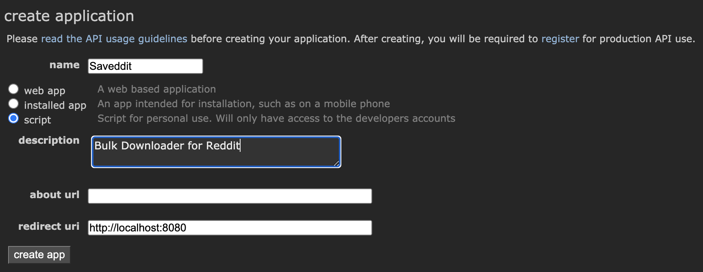
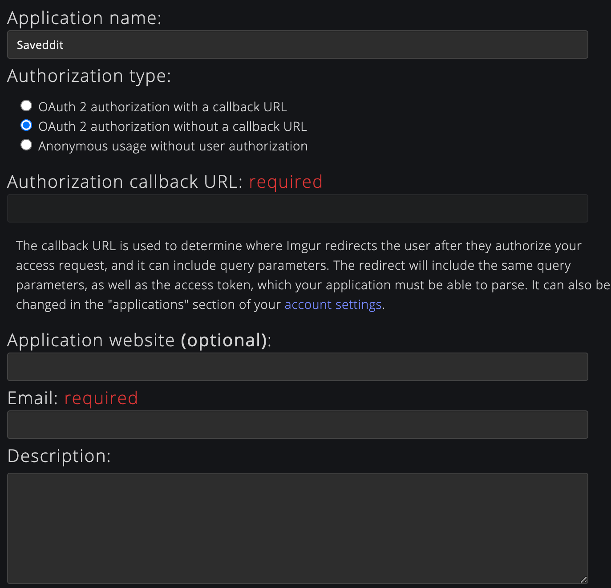

<p align="center">
  
</p>

<p align="center">
  <a href="https://badge.fury.io/py/saveddit">
    
  </a>
  <a href="https://github.com/p-ranav/indicators/blob/master/LICENSE">
    
  </a>
</p>

`saveddit` is a bulk media downloader for reddit

```console
pip3 install saveddit
```

## Setting up authorization

* [Register an application with Reddit](https://ssl.reddit.com/prefs/apps/)
  - Write down your client ID and secret from the app
  - More about Reddit API access [here](https://ssl.reddit.com/wiki/api)
  - Wiki page about Reddit OAuth2 applications [here](https://github.com/reddit-archive/reddit/wiki/OAuth2)

<p align="left">
&nbsp;&nbsp;&nbsp;&nbsp;&nbsp;&nbsp;&nbsp;&nbsp;
</p>

* [Register an application with Imgur](https://api.imgur.com/oauth2/addclient)
  - Write down the Imgur client ID from the app

<p align="left">
&nbsp;&nbsp;&nbsp;&nbsp;&nbsp;&nbsp;&nbsp;&nbsp;
</p>

These registrations will authorize you to use the Reddit and Imgur APIs to download publicly available information.

## User configuration

The first time you run `saveddit`, you will see something like this:

```console
foo@bar:~$ saveddit
Retrieving configuration from ~/.saveddit/user_config.yaml file
No configuration file found.
Creating one. Please edit ~/.saveddit/user_config.yaml with valid credentials.
Exiting
```

* Open the generated `~/.saveddit/user_config.yaml`
* Update the client IDs and secrets from the previous step
* If you plan on using the `user` API, add your reddit username as well

```yaml
imgur_client_id: '<YOUR_IMGUR_CLIENT_ID>'
reddit_client_id: '<YOUR_REDDIT_CLIENT_ID>'
reddit_client_secret: '<YOUR_REDDIT_CLIENT_SECRET>'
reddit_username: '<YOUR_REDDIT_USERNAME>'
```

## Download from Subreddit

```console
foo@bar:~$ saveddit subreddit -h
Retrieving configuration from /Users/pranav/.saveddit/user_config.yaml file

usage: saveddit subreddit [-h] [-f categories [categories ...]] [-l post_limit] [--skip-comments] [--skip-meta] [--skip-videos] -o output_path subreddits [subreddits ...]

positional arguments:
  subreddits            Names of subreddits to download, e.g., AskReddit

optional arguments:
  -h, --help            show this help message and exit
  -f categories [categories ...]
                        Categories of posts to download (default: ['hot', 'new', 'rising', 'controversial', 'top', 'gilded'])
  -l post_limit         Limit the number of submissions downloaded in each category (default: None, i.e., all submissions)
  --skip-comments       When true, saveddit will not save comments to a comments.json file
  --skip-meta           When true, saveddit will not save meta to a submission.json file on submissions
  --skip-videos         When true, saveddit will not download videos (e.g., gfycat, redgifs, youtube, v.redd.it links)
  -o output_path        Directory where saveddit will save downloaded content
```

```console
foo@bar:~$ saveddit subreddit pics -f hot -l 5 -o ~/Desktop
```

```console
foo@bar:~$ tree -L 4 ~/Desktop/www.reddit.com
/Users/pranav/Desktop/www.reddit.com
└── r
    └── pics
        └── hot
            ├── 000_Prince_Philip_Duke_of_Edinburgh_...
            ├── 001_Day_10_of_Nobody_Noticing_the_Ap...
            ├── 002_First_edited_picture
            ├── 003_Reorganized_a_few_months_ago_and...
            └── 004_Van_Gogh_inspired_rainy_street_I...
```

You can download from multiple subreddits and use multiple filters:

```console
foo@bar:~$ saveddit subreddit funny AskReddit -f hot top new rising -l 5 -o ~/Downloads/Reddit/.
```

The downloads from each subreddit to go to a separate folder like so:

```console
foo@bar:~$ tree -L 3 ~/Downloads/Reddit/www.reddit.com
/Users/pranav/Downloads/Reddit/www.reddit.com
└── r
    ├── AskReddit
    │   ├── hot
    │   ├── new
    │   ├── rising
    │   └── top
    └── funny
        ├── hot
        ├── new
        ├── rising
        └── top
```

## Download from anonymous Multireddit

To download from an anonymous multireddit, use the `multireddit` option and pass a number of subreddit names

```console
foo@bar:~$ saveddit multireddit -h
usage: saveddit multireddit [-h] [-f categories [categories ...]] [-l post_limit] [--skip-comments] [--skip-meta] [--skip-videos] -o output_path subreddits [subreddits ...]

positional arguments:
  subreddits            Names of subreddits to download, e.g., aww, pics. The downloads will be stored in <OUTPUT_PATH>/www.reddit.com/m/aww+pics/.

optional arguments:
  -h, --help            show this help message and exit
  -f categories [categories ...]
                        Categories of posts to download (default: ['hot', 'new', 'random_rising', 'rising', 'controversial', 'top', 'gilded'])
  -l post_limit         Limit the number of submissions downloaded in each category (default: None, i.e., all submissions)
  --skip-comments       When true, saveddit will not save comments to a comments.json file
  --skip-meta           When true, saveddit will not save meta to a submission.json file on submissions
  --skip-videos         When true, saveddit will not download videos (e.g., gfycat, redgifs, youtube, v.redd.it links)
  -o output_path        Directory where saveddit will save downloaded content
```

```console
foo@bar:~$ saveddit multireddit EarthPorn NaturePics -f hot -l 5 -o ~/Desktop
```

Anonymous multireddits are saved in `www.reddit.com/m/<Multireddit_names>/<category>/` like so:

```console
tree -L 4 ~/Desktop/www.reddit.com
/Users/pranav/Desktop/www.reddit.com
└── m
    └── EarthPorn+NaturePics
        └── hot
            ├── 000_Banning_State_Park_Minnesota_OC_...
            ├── 001_Misty_forest_in_the_mountains_of...
            ├── 002_One_of_the_highlights_of_my_last...
            ├── 003__OC_Japan_Kyoto_Garden_of_the_Go...
            └── 004_Sunset_at_Mt_Rainier_National_Pa...
```

## Download from User's page

```console
foo@bar:~$ saveddit user -h
usage: saveddit user [-h] users [users ...] {saved,gilded,submitted,multireddits,upvoted,comments} ...

positional arguments:
  users                 Names of users to download, e.g., Poem_for_your_sprog
  {saved,gilded,submitted,multireddits,upvoted,comments}

optional arguments:
  -h, --help            show this help message and exit
```

Here's a usage example for downloading all comments made by `Poem_for_your_sprog`

```console
foo@bar:~$ saveddit user "Poem_for_your_sprog" comments -s top -l 5 -o ~/Desktop
```

Here's another example for downloading `kemitche`'s multireddits:

```console
foo@bar:~$ saveddit user kemitche multireddits -n reddit -f hot -l 5 -o ~/Desktop
```

User-specific content is downloaded to `www.reddit.com/u/<Username>/...` like so:

```console
foo@bar:~$ tree ~/Desktop/www.reddit.com
/Users/pranav/Desktop/www.reddit.com
└── u
    ├── Poem_for_your_sprog
    │   ├── comments
    │   │   └── top
    │   │       ├── 000_Comment_my_name_is_Cow_and_wen_its_ni....json
    │   │       ├── 001_Comment_It_stopped_at_six_and_life....json
    │   │       ├── 002_Comment__Perhaps_I_could_listen_to_podca....json
    │   │       ├── 003_Comment__I_don_t_have_regret_for_the_thi....json
    │   │       └── 004_Comment__So_throw_off_the_chains_of_oppr....json
    │   └── user.json
    └── kemitche
        ├── m
        │   └── reddit
        │       └── hot
        │           ├── 000_When_posting_to_my_u_channel_NSF...
        │           │   ├── comments.json
        │           │   └── submission.json
        │           ├── 001_How_to_remove_popular_near_you
        │           │   ├── comments.json
        │           │   └── submission.json
        │           ├── 002__IOS_2021_13_0_Reddit_is_just_su...
        │           │   ├── comments.json
        │           │   └── submission.json
        │           ├── 003_The_Approve_User_button_should_n...
        │           │   ├── comments.json
        │           │   └── submission.json
        │           └── 004_non_moderators_unable_to_view_su...
        │               ├── comments.json
        │               └── submission.json
        └── user.json
```

## Search and Download

`saveddit` support searching subreddits and downloading search results

```console
foo@bar:~$ saveddit search -h
usage: saveddit search [-h] -q query [-s sort] [-t time_filter] [--include-nsfw] [--skip-comments] [--skip-meta] [--skip-videos] -o output_path subreddits [subreddits ...]

positional arguments:
  subreddits       Names of subreddits to search, e.g., all, aww, pics

optional arguments:
  -h, --help       show this help message and exit
  -q query         Search query string
  -s sort          Sort to apply on search (default: relevance, choices: [relevance, hot, top, new, comments])
  -t time_filter   Time filter to apply on search (default: all, choices: [all, day, hour, month, week, year])
  --include-nsfw   When true, saveddit will include NSFW results in search
  --skip-comments  When true, saveddit will not save comments to a comments.json file
  --skip-meta      When true, saveddit will not save meta to a submission.json file on submissions
  --skip-videos    When true, saveddit will not download videos (e.g., gfycat, redgifs, youtube, v.redd.it links)
  -o output_path   Directory where saveddit will save downloaded content
```

e.g.,

```console
foo@bar:~$ saveddit search soccer -q "Chelsea" -o ~/Desktop
```

The downloaded search results are stored in `www.reddit.com/q/<search_query>/<subreddits>/<sort>/.`

```console
foo@bar:~$ tree -L 4 ~/Desktop/www.reddit.com/q
/Users/pranav/Desktop/www.reddit.com/q
└── Chelsea
    └── soccer
        └── relevance
            ├── 000__Official_Results_for_UEFA_Champ...
            ├── 001_Porto_0_1_Chelsea_Mason_Mount_32...
            ├── 002_Crystal_Palace_0_2_Chelsea_Chris...
            ├── 003_Post_Match_Thread_Chelsea_2_5_We...
            ├── 004_Match_Thread_Porto_vs_Chelsea_UE...
            ├── 005_Crystal_Palace_1_4_Chelsea_Chris...
            ├── 006_Porto_0_2_Chelsea_Ben_Chilwell_8...
            ├── 007_Post_Match_Thread_Porto_0_2_Chel...
            ├── 008_UCL_Quaterfinalists_are_Bayern_D...
            ├── 009__MD_Mino_Raiola_and_Haaland_s_fa...
            ├── 010_Chelsea_2_5_West_Brom_Callum_Rob...
            ├── 011_Chelsea_1_2_West_Brom_Matheus_Pe...
            ├── 012__Bild_Sport_via_Sport_Witness_Ch...
            ├── 013_Match_Thread_Chelsea_vs_West_Bro...
            ├── 014_Chelsea_1_3_West_Brom_Callum_Rob...
            ├── 015_Match_Thread_Chelsea_vs_Atletico...
            ├── 016_Stefan_Savi�\207_Atlético_Madrid_str...
            ├── 017_Chelsea_1_0_West_Brom_Christian_...
            └── 018_Alvaro_Morata_I_ve_never_had_dep...
```

## Supported Links:

* Direct links to images or videos, e.g., `.png`, `.jpg`, `.mp4`, `.gif` etc.
* Reddit galleries `reddit.com/gallery/...`
* Reddit videos `v.redd.it/...`
* Gfycat links `gfycat.com/...`
* Redgif links `redgifs.com/...`
* Imgur images `imgur.com/...`
* Imgur albums `imgur.com/a/...` and `imgur.com/gallery/...`
* Youtube links `youtube.com/...` and `yout.be/...`
* These [sites](https://ytdl-org.github.io/youtube-dl/supportedsites.html) supported by `youtube-dl`
* Self posts
* For all other cases, `saveddit` will simply fetch the HTML of the URL

## Contributing
Contributions are welcome, have a look at the [CONTRIBUTING.md](CONTRIBUTING.md) document for more information.

## License
The project is available under the [MIT](https://opensource.org/licenses/MIT) license.
